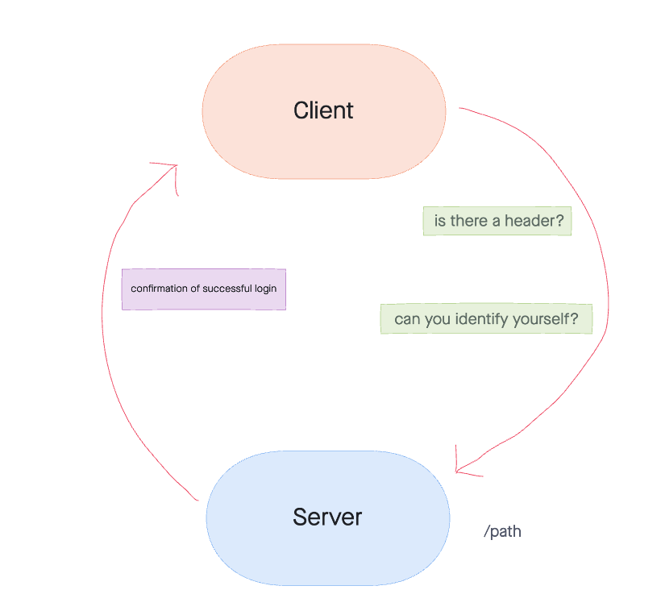

# Basic-Auth

Created by Sarah Creager

## Installation
`npm install`  

*sample .env file:*
``` 
PORT=3001

DATABASE_URL=postgresql://localhost:5432
```

## Dependencies
 * base-64
 * bcrypt
 * cors
 * dotenv
 * express
 * jest
 * pg
 * sequelize
 * sequelize-cli
 * sqlite3


## Summary of Problem Domain
Built basic auth

## Links to application deployment

[Deployed Heroku Application](https://sarah-basic-auth.herokuapp.com/)

[GitHub](https://github.com/SarahCreager/basic-auth.git)

## UML



## Routes

Method: POST
Path: /  

Method: POST
Path: /  

